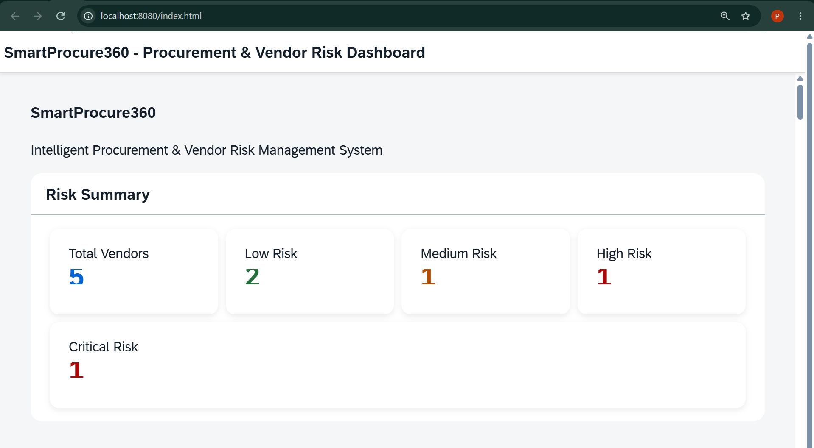
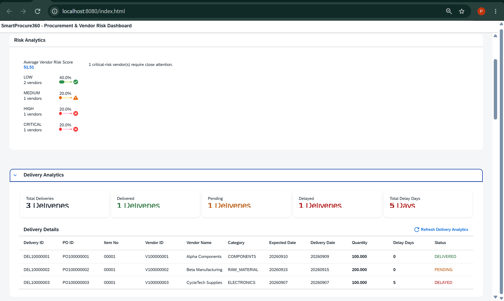
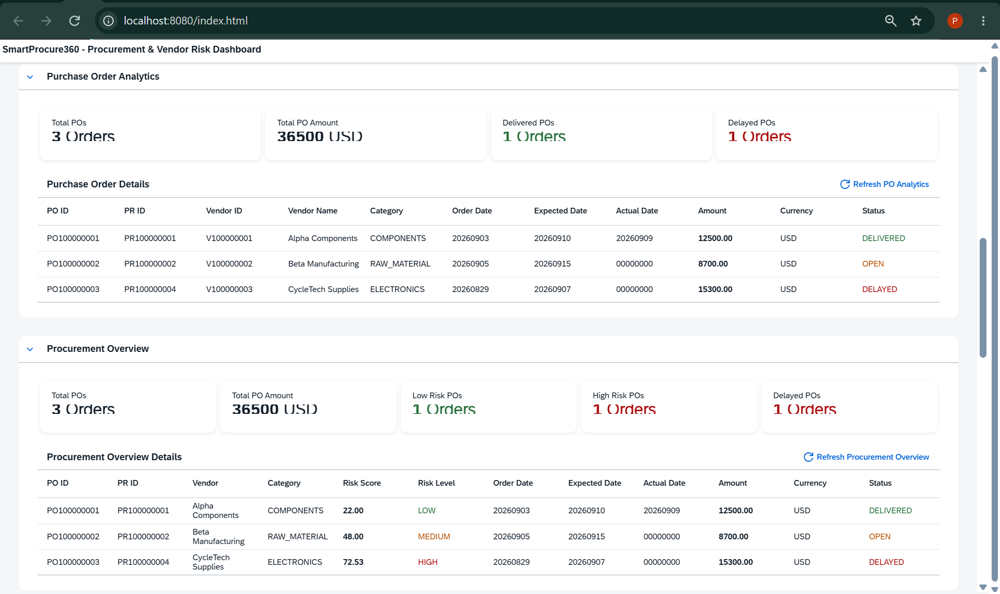
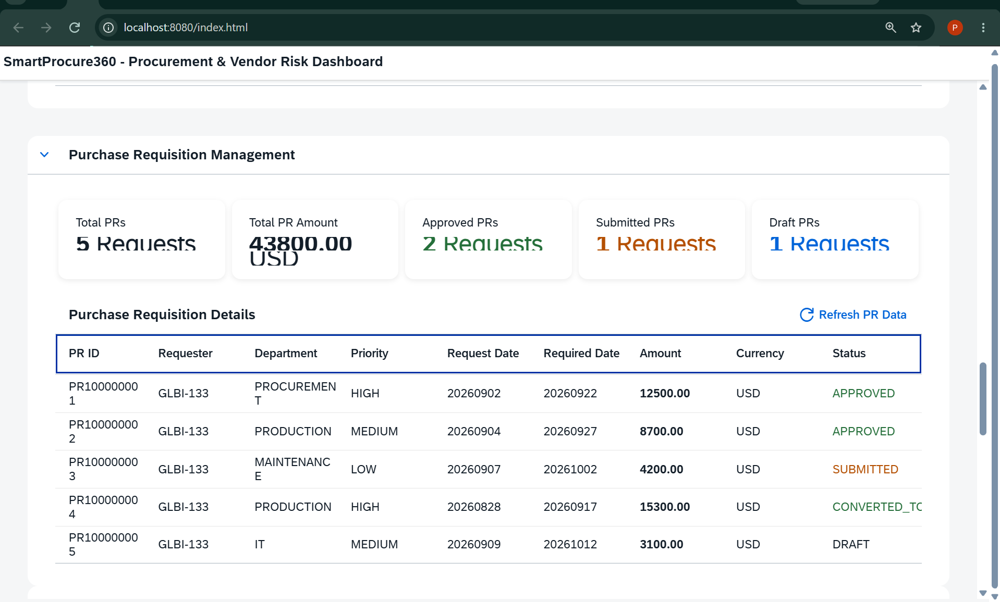
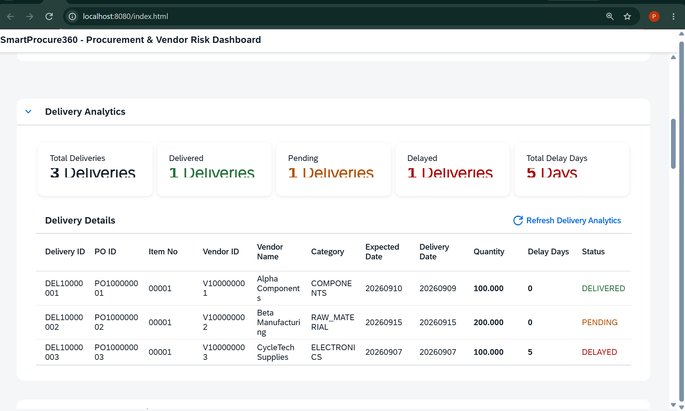
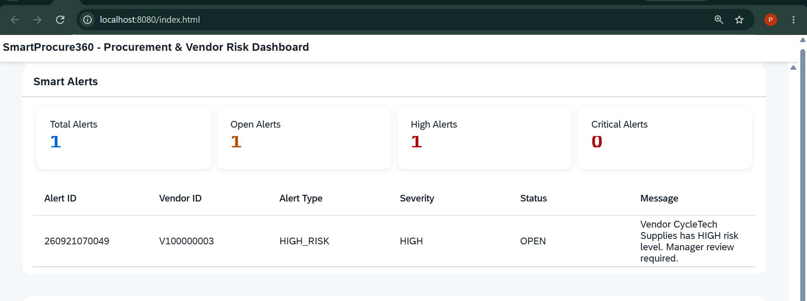
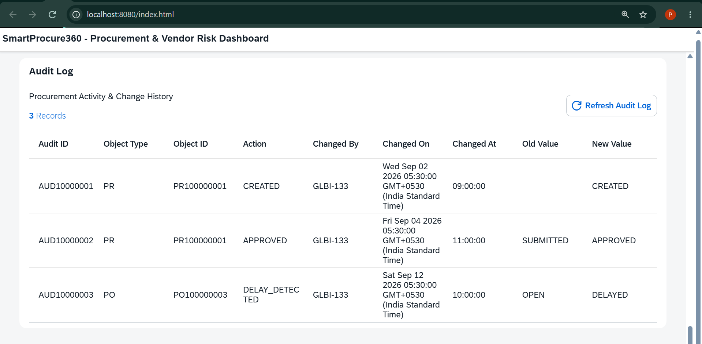
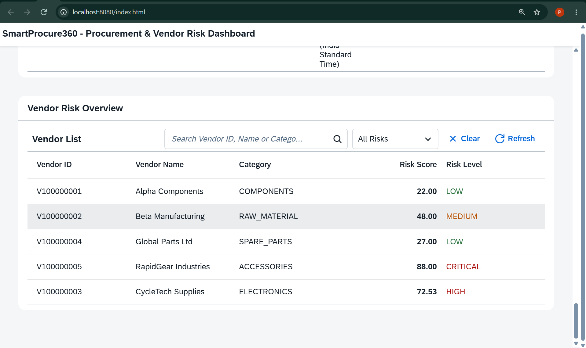
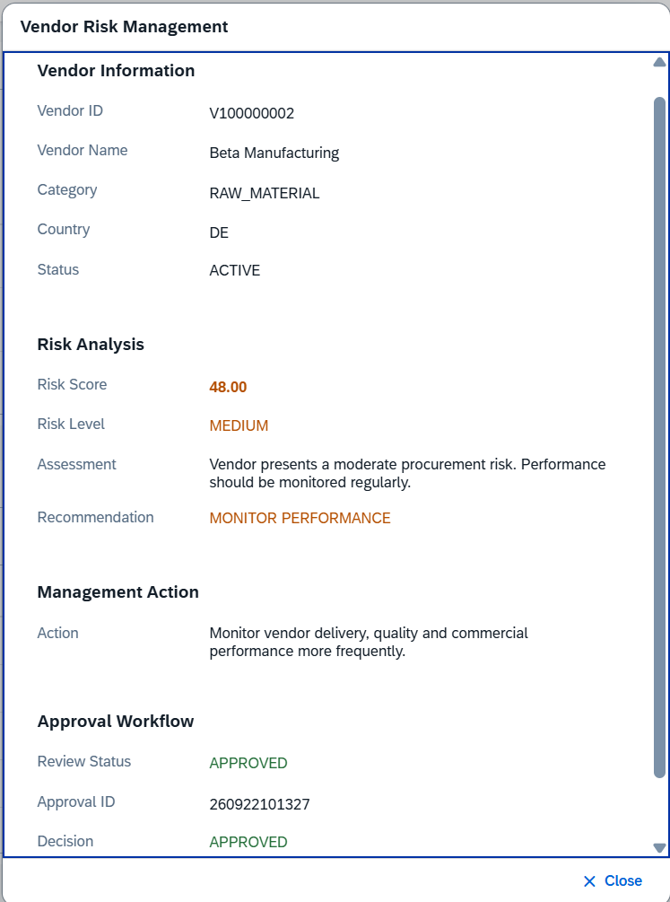
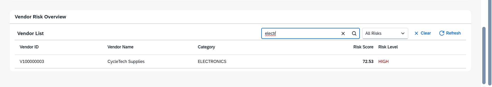

# SmartProcure360

## Intelligent Procurement & Vendor Risk Management System

SmartProcure360 is an SAP-based procurement and vendor risk management application that provides centralized visibility into vendor performance, procurement activities, delivery performance, purchase orders, purchase requisitions, quality results, risk analysis, approval workflows, smart alerts, and audit history.

The project demonstrates an end-to-end enterprise application built using:

- SAP ABAP
- Object-Oriented ABAP
- Open SQL
- CDS Views
- SAP Gateway OData V2
- SAPUI5
- JavaScript
- XML Views
- Git and GitHub

The application combines SAP backend business logic with a SAPUI5 dashboard to provide a single interface for procurement monitoring and vendor risk management.

---

# Table of Contents

- [Project Overview](#project-overview)
- [Business Problem](#business-problem)
- [Solution](#solution)
- [Key Features](#key-features)
- [System Architecture](#system-architecture)
- [Business Process](#business-process)
- [Technology Stack](#technology-stack)
- [SAP Data Model](#sap-data-model)
- [ABAP Risk Engine](#abap-risk-engine)
- [Risk Calculation](#risk-calculation)
- [CDS Views](#cds-views)
- [OData Service](#odata-service)
- [SAPUI5 Application](#sapui5-application)
- [Approval Workflow](#approval-workflow)
- [Smart Alerts](#smart-alerts)
- [Audit Log](#audit-log)
- [Project Structure](#project-structure)
- [Prerequisites](#prerequisites)
- [Installation and Setup](#installation-and-setup)
- [Running the Project](#running-the-project)
- [SAP Backend Configuration](#sap-backend-configuration)
- [Demo Data](#demo-data)
- [Testing](#testing)
- [Screenshots](#screenshots)
- [Troubleshooting](#troubleshooting)
- [Technical Highlights](#technical-highlights)
- [Future Enhancements](#future-enhancements)
- [Learning Outcomes](#learning-outcomes)
- [Author](#author)

---

# Project Overview

Procurement teams need to continuously monitor vendors, purchase orders, deliveries, quality performance, pricing, approvals, and historical performance.

In many business environments, these activities are distributed across different processes and systems.

SmartProcure360 brings these activities together into a centralized SAP-based procurement monitoring application.

The application provides:

- Vendor management
- Purchase requisition monitoring
- Purchase order analytics
- Delivery analytics
- Vendor quality analysis
- Vendor risk calculation
- Risk classification
- Approval workflow
- Smart alerts
- Audit logging
- Procurement analytics
- SAPUI5 dashboard
- OData-based backend integration

---

# Business Problem

A procurement organization may face problems such as:

- Difficulty monitoring vendor performance
- Delayed deliveries
- Poor quality from suppliers
- Increasing procurement costs
- Lack of centralized vendor risk visibility
- Manual approval tracking
- Lack of historical audit information
- Delayed identification of high-risk vendors

SmartProcure360 addresses these problems by combining procurement data and vendor performance indicators into a centralized risk management workflow.

---

# Solution

The system follows this overall process:

```text
Vendor Data
     |
     v
Procurement Activity
     |
     v
Purchase Requisition
     |
     v
Purchase Order
     |
     v
Delivery & Quality Tracking
     |
     v
Vendor Performance Analysis
     |
     v
Risk Score Calculation
     |
     v
Risk Classification
     |
     +------------------+
     |                  |
     v                  v
Normal Monitoring    Management Review
                        |
                        v
                   Approval Workflow
                        |
                        v
                  Smart Alerts
                        |
                        v
                    Audit Log
```

---

# Key Features

## 1. Vendor Management

The system maintains vendor information including:

- Vendor ID
- Vendor Name
- Category
- Country
- Email
- Phone
- Status
- Risk Score
- Risk Level

---

## 2. Vendor Risk Management

The system calculates vendor risk using multiple performance dimensions.

| Factor | Weight |
|---|---:|
| Delivery Performance | 40% |
| Quality Performance | 30% |
| Price Performance | 20% |
| Historical Performance | 10% |

The calculated risk score is used to classify vendors into four risk categories:

| Risk Score | Risk Level |
|---:|---|
| 0–30 | LOW |
| 31–60 | MEDIUM |
| 61–80 | HIGH |
| 81–100 | CRITICAL |

---

## 3. Risk Recommendations

The system generates a management recommendation based on the risk score.

| Risk Level | Recommendation |
|---|---|
| LOW | Normal Monitoring |
| MEDIUM | Monitor Performance |
| HIGH | Manager Review |
| CRITICAL | Urgent Review |

---

## 4. Purchase Requisition Management

The application provides visibility into purchase requisitions.

Information includes:

- PR ID
- Requester
- Department
- Priority
- Request Date
- Required Date
- Total Amount
- Currency
- Status

Dashboard statistics include:

- Total PRs
- Total PR Amount
- Approved PRs
- Submitted PRs
- Draft PRs

---

## 5. Purchase Order Analytics

Purchase order analytics include:

- Purchase Order ID
- Purchase Requisition ID
- Vendor ID
- Vendor Name
- Vendor Category
- Order Date
- Expected Date
- Actual Date
- Total Amount
- Currency
- PO Status

Dashboard metrics include:

- Total Purchase Orders
- Total PO Amount
- Delivered POs
- Delayed POs

---

## 6. Delivery Analytics

Delivery performance is monitored using:

- Delivery ID
- Purchase Order ID
- Item Number
- Vendor
- Expected Delivery Date
- Delivery Date
- Quantity
- Delay Days
- Delivery Status

Dashboard metrics include:

- Total Deliveries
- Delivered
- Pending
- Delayed
- Total Delay Days

---

## 7. Approval Workflow

The system provides an approval workflow for vendor risk reviews.

```text
Vendor Risk Detected
        |
        v
Mark for Review
        |
        v
Approval Request Created
        |
        v
Pending
        |
        +----------------+
        |                |
        v                v
     Approve           Reject
        |                |
        +-------+--------+
                |
                v
       Decision Stored in SAP
```

Approval information includes:

- Approval ID
- Document Type
- Document ID
- Approver
- Approval Level
- Decision
- Decision Date
- Comments

---

## 8. Smart Alerts

SmartProcure360 generates alerts for important procurement and vendor-risk situations.

Example:

```text
Vendor CycleTech Supplies has HIGH risk level.
Manager review required.
```

Alert information includes:

- Alert ID
- Vendor ID
- Alert Type
- Severity
- Status
- Message

---

## 9. Audit Log

The application maintains an audit trail for important business actions.

Audit information includes:

- Audit ID
- Object Type
- Object ID
- Action
- Changed By
- Changed On
- Changed At
- Old Value
- New Value

This provides traceability for procurement-related activities.

---

# System Architecture

```text
+-------------------------------------------------------+
|                  SAPUI5 FRONTEND                      |
|                                                       |
| Dashboard | Analytics | Vendor Risk | Approval       |
| Alerts    | Audit Log | PR Management | PO Analytics |
+---------------------------+---------------------------+
                            |
                            | OData V2
                            v
+-------------------------------------------------------+
|               SAP GATEWAY / ODATA                    |
|                                                       |
|              ZSP360_ODATA_SRV                        |
+---------------------------+---------------------------+
                            |
                            v
+-------------------------------------------------------+
|                 ABAP APPLICATION                     |
|                                                       |
| Risk Engine | Approval Logic | Alert Logic           |
| Business Logic | Open SQL | CRUD Operations          |
+---------------------------+---------------------------+
                            |
                            v
+-------------------------------------------------------+
|                CDS / DATA ACCESS                     |
|                                                       |
| Vendor Risk | PO Analytics | Delivery Analytics      |
| Procurement Overview                                  |
+---------------------------+---------------------------+
                            |
                            v
+-------------------------------------------------------+
|                  SAP DATABASE                        |
|                                                       |
| Vendor | PR | PO | Delivery | Quality                |
| Risk | Approval | Audit | Alert                       |
+-------------------------------------------------------+
```

---

# Business Process

```text
Vendor
  |
  v
Purchase Requisition
  |
  v
Purchase Order
  |
  v
Delivery
  |
  v
Quality Evaluation
  |
  v
Vendor Performance
  |
  v
Risk Engine
  |
  v
Risk Score
  |
  v
Risk Level
  |
  +----------------------------+
  |                            |
  v                            v
LOW / MEDIUM              HIGH / CRITICAL
  |                            |
  v                            v
Monitoring                Management Review
                               |
                               v
                         Approval Workflow
                               |
                               v
                          Smart Alert
                               |
                               v
                           Audit Log
```

---

# Technology Stack

## SAP Backend

- SAP S/4HANA 1809
- SAP ABAP
- Object-Oriented ABAP
- Open SQL
- SAP Gateway
- OData V2
- CDS Views
- SAP GUI
- Eclipse ADT

## Frontend

- SAPUI5
- JavaScript
- XML Views
- JSONModel
- ODataModel V2
- HTML5
- CSS3

## Development Tools

- SAP GUI
- Eclipse / ABAP Development Tools
- Visual Studio Code
- Node.js
- UI5 CLI
- Git
- GitHub

---

# SAP Data Model

The project uses custom SAP tables for procurement and vendor risk management.

```text
ZSP360_VENDOR
ZSP360_PR
ZSP360_PR_ITEM
ZSP360_PO
ZSP360_PO_ITEM
ZSP360_DELIVERY
ZSP360_QUALITY
ZSP360_RISK
ZSP360_APPROVAL
ZSP360_AUDIT
ZSP360_ALERT
```

## Main Data Relationships

```text
Vendor
 |
 +---- Purchase Requisition
 |            |
 |            +---- Purchase Order
 |                      |
 |                      +---- Delivery
 |                      |
 |                      +---- Quality
 |
 +---- Risk Analysis
          |
          +---- Approval
          |
          +---- Alert
          |
          +---- Audit Log
```

---

# ABAP Risk Engine

The central business logic is implemented in the custom ABAP class:

```text
ZCL_SP360_RISK_ENGINE
```

The class contains methods for:

```text
CALCULATE_FINAL_SCORE
GET_RISK_LEVEL
GET_RECOMMENDATION
GET_DELIVERY_SCORE
GET_QUALITY_SCORE
GET_PRICE_SCORE
GET_HISTORY_SCORE
CALCULATE_VENDOR_RISK
```

The engine reads procurement and vendor performance data from SAP tables and calculates the current vendor risk.

---

# Risk Calculation

The risk engine calculates a weighted performance score.

```text
Performance Score =

    Delivery Score × 40%
  + Quality Score  × 30%
  + Price Score    × 20%
  + History Score  × 10%
```

The final risk score is:

```text
Risk Score = 100 - Performance Score
```

The result is constrained to the range:

```text
0 to 100
```

---

## Example Risk Calculation

Example input:

```text
Delivery Score = 55
Quality Score  = 70
Price Score    = 65
History Score  = 72
```

Calculation:

```text
55 × 0.40 = 22.00
70 × 0.30 = 21.00
65 × 0.20 = 13.00
72 × 0.10 =  7.20
--------------------
Performance Score = 63.20
```

Therefore:

```text
Risk Score = 100 - 63.20
           = 36.80
```

A score of 36.80 falls into the configured:

```text
MEDIUM
```

risk range.

---

# Database-Driven Risk Analysis

The risk engine can calculate performance using actual SAP database information.

## Delivery Score

Delivery performance is calculated using delivery and purchase order information.

Delayed deliveries are identified using delay days.

```text
Delivery Score =
100 - Delayed Deliveries Percentage
```

If delivery history is unavailable, a default baseline score is used.

---

## Quality Score

Quality performance is calculated using vendor quality records.

The system evaluates the recorded quality score for the vendor.

---

## Price Score

Price performance compares vendor pricing against the overall procurement price baseline.

The calculation identifies whether the vendor's pricing is below, equal to, or above the reference average.

---

## History Score

Historical performance considers:

- Delivery delay history
- Quality rejection history

The historical score combines these factors into a single performance indicator.

---

# CDS Views

The project uses CDS Views for reusable analytical data models.

## Vendor Risk Analytics

```text
ZC_SP360_VENDOR_RISK
```

Provides vendor risk information including:

- Vendor ID
- Vendor Name
- Category
- Country
- Status
- Risk Score
- Risk Level
- Created On
- Created By

---

## Purchase Order Analytics

```text
ZC_SP360_PO_ANALYTICS
```

Provides:

- PO ID
- PR ID
- Vendor ID
- Vendor Name
- Vendor Category
- Order Date
- Expected Date
- Actual Date
- Total Amount
- Currency
- PO Status

---

## Delivery Analytics

```text
ZC_SP360_DELIVERY_ANALYTICS
```

Provides:

- Delivery ID
- PO ID
- Item Number
- Vendor
- Expected Date
- Delivery Date
- Quantity
- Delay Days
- Delivery Status

---

## Procurement Overview

```text
ZC_SP360_PROCUREMENT_OVERVIEW
```

Combines procurement and vendor-risk information.

---

# OData Service

The main SAP Gateway service is:

```text
ZSP360_ODATA_SRV
```

The service exposes the following entity sets:

| Entity Set | Purpose |
|---|---|
| `VendorRiskSet` | Vendor risk information |
| `AlertSet` | Smart alerts |
| `AuditSet` | Audit history |
| `ApprovalSet` | Approval workflow |
| `POAnalyticsSet` | Purchase order analytics |
| `ProcOverviewSet` | Procurement overview |
| `DeliveryAnlySet` | Delivery analytics |
| `PRSet` | Purchase requisitions |

The SAPUI5 frontend consumes these OData endpoints using the SAPUI5 OData V2 model.

---

# SAPUI5 Application

The frontend follows the SAPUI5 MVC architecture.

```text
View
 |
 | XML
 v
Controller
 |
 | JavaScript
 v
ODataModel
 |
 | OData V2
 v
SAP Gateway
 |
 v
ABAP Backend
```

---

# Dashboard Modules

## Risk Summary

Displays:

- Total Vendors
- Low Risk
- Medium Risk
- High Risk
- Critical Risk

## Risk Analytics

Provides aggregated vendor risk information.

## Delivery Analytics

Displays:

- Total Deliveries
- Delivered
- Pending
- Delayed
- Total Delay Days

## Purchase Order Analytics

Displays:

- Total POs
- Total PO Amount
- Delivered POs
- Delayed POs

## Procurement Overview

Combines purchase order and vendor risk information.

## Purchase Requisition Management

Displays:

- PR ID
- Requester
- Department
- Priority
- Request Date
- Required Date
- Amount
- Currency
- Status

## Smart Alerts

Displays active procurement and vendor risk alerts.

## Audit Log

Displays historical business changes.

## Vendor Risk Overview

Provides:

- Vendor search
- Risk filtering
- Vendor details
- Risk analysis
- Management action
- Approval workflow

---

# Approval Workflow

The UI provides vendor-level management actions.

Example workflow:

```text
Open Vendor Details
        |
        v
Review Risk
        |
        v
Mark for Review
        |
        v
Create Approval Request
        |
        v
Pending
        |
        +------------------+
        |                  |
        v                  v
     Approve             Reject
        |                  |
        +--------+---------+
                 |
                 v
        Decision persisted
             in SAP
```

Approval requests are stored in:

```text
ZSP360_APPROVAL
```

---

# Smart Alerts

Smart alerts provide proactive visibility into important vendor situations.

Example alert:

```text
Alert Type : HIGH_RISK
Severity   : HIGH
Status     : OPEN

Vendor CycleTech Supplies has HIGH risk level.
Manager review required.
```

Alerts are stored and exposed through:

```text
AlertSet
```

---

# Audit Logging

Business actions are recorded in:

```text
ZSP360_AUDIT
```

The audit log tracks:

```text
Audit ID
Object Type
Object ID
Action
Changed By
Changed On
Changed At
Old Value
New Value
```

The SAPUI5 frontend formats the SAP OData V2 time value for user-friendly display.

---

# Project Structure

```text
SmartProcure360/
│
├── .gitignore
├── README.md
│
├── screenshots/
│   ├── dashboard.png
│   ├── risk-analytics.png
│   ├── procurement-overview.png
│   ├── purchase-requisitions.png
│   ├── delivery-analytics.png
│   ├── smart-alerts.png
│   ├── audit-log.png
│   ├── vendor-details.png
│   ├── approval-workflow.png
│   └── vendor-risk-filter.png
│
└── ui/
    │
    ├── controller/
    │   └── App.controller.js
    │
    ├── view/
    │   └── App.view.xml
    │
    ├── i18n/
    │   └── i18n.properties
    │
    ├── css/
    │
    ├── Component.js
    ├── index.html
    ├── manifest.json
    ├── package.json
    ├── package-lock.json
    └── ui5.yaml
```

> SAP backend artifacts are developed and activated in the SAP S/4HANA system. The repository contains the frontend project and project documentation. SAP backend source artifacts can be exported/documented separately when required.

---

# Prerequisites

Before running SmartProcure360, the following environment is required.

## SAP System

- SAP S/4HANA 1809 or compatible ABAP system
- SAP GUI
- SAP Gateway
- Eclipse with ADT
- Access to the custom package and objects

## Frontend Environment

Install:

- Node.js
- npm
- UI5 CLI
- Visual Studio Code
- Git

Check Node.js:

```powershell
node --version
```

Check npm:

```powershell
npm --version
```

Check UI5 CLI:

```powershell
ui5 --version
```

Check Git:

```powershell
git --version
```

---

# SAP Backend Configuration

The frontend depends on the following SAP backend components.

## 1. Custom Package

```text
ZSP360
```

Description:

```text
SmartProcure360 - Procurement & Vendor Risk
```

---

## 2. Custom Tables

Create and activate:

```text
ZSP360_VENDOR
ZSP360_PR
ZSP360_PR_ITEM
ZSP360_PO
ZSP360_PO_ITEM
ZSP360_DELIVERY
ZSP360_QUALITY
ZSP360_RISK
ZSP360_APPROVAL
ZSP360_AUDIT
ZSP360_ALERT
```

---

## 3. ABAP Risk Engine

Create and activate:

```text
ZCL_SP360_RISK_ENGINE
```

The class implements the vendor risk calculation logic.

---

## 4. Demo Data

Load demo data using:

```text
ZSP360_LOAD_TEST_DATA
```

The test data creates vendors, PRs, POs, deliveries, quality records, risk records, approvals, alerts, and audit records.

---

## 5. CDS Views

Activate:

```text
ZC_SP360_VENDOR_RISK
ZC_SP360_PO_ANALYTICS
ZC_SP360_DELIVERY_ANALYTICS
ZC_SP360_PROCUREMENT_OVERVIEW
```

---

## 6. OData Service

The SEGW project is:

```text
ZSP360_ODATA
```

The technical service is:

```text
ZSP360_ODATA_SRV
```

Register the service through:

```text
/IWFND/MAINT_SERVICE
```

The following entity sets should be available:

```text
VendorRiskSet
AlertSet
AuditSet
ApprovalSet
POAnalyticsSet
ProcOverviewSet
DeliveryAnlySet
PRSet
```

---

# Frontend Installation

Clone the repository:

```powershell
git clone https://github.com/PRIYDARSHANGLBITM/SmartProcure360.git
```

Move into the UI project:

```powershell
cd SmartProcure360\ui
```

Install dependencies:

```powershell
npm install
```

This installs the dependencies defined in:

```text
package.json
```

---

# SAP Connection Configuration

The UI5 project uses a proxy middleware to forward `/sap` requests to the SAP Gateway server.

The proxy configuration is maintained in:

```text
ui/ui5.yaml
```

The repository should not contain SAP passwords or private credentials.

If environment-specific credentials or configuration are required, keep them outside Git and use a local `.env` file.

Example:

```text
.env
```

The `.env` file is intentionally excluded through `.gitignore`.

Never commit:

```text
.env
```

or any file containing:

- SAP username
- SAP password
- API keys
- private tokens
- confidential server credentials

---

# Running the Project

After installing dependencies:

```powershell
cd SmartProcure360\ui
```

Start the UI5 development server:

```powershell
npx ui5 serve --port 8080
```

The application will be available at:

```text
http://localhost:8080
```

Open the application in a browser.

---

# Verifying the SAP Connection

Before testing the UI, verify that the SAP OData service is reachable.

Metadata endpoint:

```text
/sap/opu/odata/sap/ZSP360_ODATA_SRV/$metadata
```

Vendor risk endpoint:

```text
/sap/opu/odata/sap/ZSP360_ODATA_SRV/VendorRiskSet
```

Purchase requisition endpoint:

```text
/sap/opu/odata/sap/ZSP360_ODATA_SRV/PRSet
```

Purchase order analytics:

```text
/sap/opu/odata/sap/ZSP360_ODATA_SRV/POAnalyticsSet
```

Delivery analytics:

```text
/sap/opu/odata/sap/ZSP360_ODATA_SRV/DeliveryAnlySet
```

Procurement overview:

```text
/sap/opu/odata/sap/ZSP360_ODATA_SRV/ProcOverviewSet
```

Smart alerts:

```text
/sap/opu/odata/sap/ZSP360_ODATA_SRV/AlertSet
```

Audit log:

```text
/sap/opu/odata/sap/ZSP360_ODATA_SRV/AuditSet
```

Approval workflow:

```text
/sap/opu/odata/sap/ZSP360_ODATA_SRV/ApprovalSet
```

If these endpoints return valid OData responses, the SAP backend integration is available.

---

# Complete Startup Flow

For a new developer, the complete process is:

```text
1. Clone GitHub repository
          |
          v
2. Install Node.js
          |
          v
3. Install UI5 dependencies
          |
          v
4. Configure SAP backend
          |
          v
5. Activate tables
          |
          v
6. Activate ABAP classes
          |
          v
7. Activate CDS views
          |
          v
8. Register OData service
          |
          v
9. Load demo data
          |
          v
10. Verify OData endpoints
          |
          v
11. Start UI5 server
          |
          v
12. Open browser
          |
          v
13. Test dashboard
```

---

# Demo Data

The project includes demonstration vendors with different risk levels.

| Vendor ID | Vendor | Risk Level |
|---|---|---|
| `V100000001` | Alpha Components | LOW |
| `V100000002` | Beta Manufacturing | MEDIUM |
| `V100000003` | CycleTech Supplies | HIGH |
| `V100000004` | Global Parts Ltd | LOW |
| `V100000005` | RapidGear Industries | CRITICAL |

---

# Current Demo Metrics

The current demo dataset produces approximately:

| Metric | Value |
|---|---:|
| Total Vendors | 5 |
| Low Risk Vendors | 2 |
| Medium Risk Vendors | 1 |
| High Risk Vendors | 1 |
| Critical Risk Vendors | 1 |
| Total Purchase Orders | 3 |
| Total PO Amount | 36,500 USD |
| Total Purchase Requisitions | 5 |
| Total PR Amount | 43,800 USD |
| Total Deliveries | 3 |
| Delivered | 1 |
| Pending | 1 |
| Delayed | 1 |
| Total Delay Days | 5 |

These values depend on the current demo data stored in the SAP system.

---

# Testing

The application has been tested across the major business functions.

## Dashboard Testing

- Vendor count verification
- Risk category verification
- Risk analytics verification

## Procurement Testing

- Purchase order data
- Purchase requisition data
- Delivery analytics
- Procurement overview
- Currency display
- Status display

## Vendor Risk Testing

- Vendor search
- Risk filtering
- Vendor details dialog
- Risk assessment
- Management action

## Approval Workflow Testing

- Mark for Review
- Approval request creation
- Pending status
- Approve
- Reject
- Backend persistence
- Browser refresh persistence

## Alert Testing

- Alert retrieval
- Alert status
- Alert severity
- Vendor risk alert

## Audit Testing

- Audit data retrieval
- Changed By
- Changed On
- Changed At
- Object type
- Action

## Edge Case Testing

- No-result search
- Invalid search input
- Empty result handling
- Browser refresh
- Backend persistence

---

# Screenshots

Screenshots are included to demonstrate the working SAPUI5 application.

## Risk Dashboard



The dashboard displays overall vendor risk distribution and procurement KPIs.

---

## Risk Analytics



The risk analytics section provides vendor risk information and aggregated risk metrics.

---

## Procurement Overview



The procurement overview combines purchase order and vendor risk information.

---

## Purchase Requisition Management



Displays PR information including requester, department, priority, dates, amount, currency, and status.

---

## Delivery Analytics



Displays delivery status, expected dates, delivery dates, quantities, and delay information.

---

## Smart Alerts



Displays active vendor-risk alerts and their severity.

---

## Audit Log



Displays historical procurement and business actions.

---

## Vendor Details



The vendor details dialog provides risk analysis, management action, and approval workflow information.

---

## Approval Workflow



Shows the vendor review and approval workflow.

---

## Vendor Search and Risk Filter



Demonstrates vendor search and risk-level filtering.

---

# Screenshot Guidelines

For a professional GitHub presentation, screenshots should:

- Show the complete application window
- Avoid personal information
- Avoid SAP usernames/passwords
- Avoid credentials
- Avoid confidential company information
- Use consistent browser zoom
- Show the dashboard clearly
- Use meaningful screenshot filenames

Recommended screenshot directory:

```text
screenshots/
├── dashboard.png
├── risk-analytics.png
├── procurement-overview.png
├── purchase-requisitions.png
├── delivery-analytics.png
├── smart-alerts.png
├── audit-log.png
├── vendor-details.png
├── approval-workflow.png
└── vendor-risk-filter.png
```

---

# Troubleshooting

## UI5 server does not start

Check Node.js:

```powershell
node --version
```

Check npm:

```powershell
npm --version
```

Install dependencies again:

```powershell
npm install
```

Then run:

```powershell
npx ui5 serve --port 8080
```

---

## OData service not available

Verify:

```text
ZSP360_ODATA_SRV
```

in SAP Gateway.

Check service registration using:

```text
/IWFND/MAINT_SERVICE
```

Also verify the relevant entity set in the service metadata.

---

## UI loads but data is empty

Check:

1. SAP backend is available.
2. OData service is registered.
3. Demo data exists.
4. Entity set names are correct.
5. Browser Network tab for OData errors.
6. SAP Gateway logs if required.

---

## OData metadata error

Verify:

```text
/sap/opu/odata/sap/ZSP360_ODATA_SRV/$metadata
```

If metadata does not load, check the SAP Gateway service registration and activation.

---

## Approval request fails

Verify:

```text
ZSP360_APPROVAL
```

exists and is active.

Also verify that:

```text
ApprovalSet
```

is available in the OData service.

---

## Audit time displays incorrectly

The frontend contains a formatter for SAP OData V2 `Edm.Time` values.

The formatter converts the OData time object into a readable:

```text
HH:MM:SS
```

format.

---

# Security

Sensitive information must never be committed to GitHub.

The repository intentionally excludes:

```text
.env
node_modules/
.vscode/
```

Do not commit:

- SAP passwords
- SAP usernames
- API keys
- Access tokens
- Private certificates
- Confidential business data

The `.gitignore` file is used to prevent accidental commits of local secrets and development dependencies.

---

# Technical Highlights

This project demonstrates practical implementation of:

- SAP ABAP
- Object-Oriented ABAP
- ABAP Open SQL
- Database-driven business logic
- Custom SAP tables
- Data elements and domains
- CDS Views
- SAP Gateway
- OData V2
- OData CRUD operations
- SAPUI5 MVC architecture
- XML Views
- JavaScript controllers
- JSONModel
- ODataModel
- UI5 formatters
- Vendor risk engine
- Approval workflow
- Smart alerts
- Audit logging
- Frontend/backend integration
- Git
- GitHub
- UI5 CLI

---

# Why This Project Is Useful for SAP Interviews

The project provides practical discussion points around:

### ABAP

- Internal tables
- Work areas
- Open SQL
- SELECT operations
- INSERT and UPDATE
- Object-oriented ABAP
- Static methods
- Exception handling

### SAP Gateway

- SEGW
- Entity Types
- Entity Sets
- DPC_EXT
- CRUD methods
- OData V2
- Service registration

### CDS

- CDS Views
- SQL View names
- Associations and joins
- Analytical data consumption

### SAPUI5

- MVC architecture
- XML Views
- Controllers
- ODataModel
- JSONModel
- Data binding
- Formatters
- Filtering
- Dialogs
- Event handling

### Business Logic

- Vendor risk calculation
- Procurement analytics
- Approval workflow
- Smart alerts
- Audit trail

---

# Future Enhancements

Potential future improvements include:

- SAP Fiori Launchpad integration
- Role-based authorization
- Email notifications
- Advanced procurement KPIs
- Supplier scorecards
- Historical risk trend charts
- Machine-learning-based risk prediction
- Automated purchase order recommendations
- Advanced CDS analytical queries
- ABAP Unit testing
- CI/CD pipeline
- Automated deployment
- Role-based approval hierarchy
- Supplier performance benchmarking

---

# Learning Outcomes

The project provided practical experience in:

- SAP ABAP development
- Enterprise data modeling
- SAP database development
- Object-oriented programming
- CDS-based analytics
- OData service development
- SAP Gateway integration
- SAPUI5 application development
- Frontend/backend integration
- Procurement business processes
- Vendor risk management
- Approval workflow implementation
- Audit logging
- Git/GitHub project management

---

# Author

## Priy Darshan 

SmartProcure360 is a placement-focused SAP project demonstrating an end-to-end procurement and vendor risk management solution using SAP technologies.

---

# Repository

GitHub:

https://github.com/PRIYDARSHANGLBITM/SmartProcure360

---

# Disclaimer

This project is developed for educational, demonstration, portfolio, and placement purposes.

No SAP passwords, private credentials, API keys, or confidential authentication information should be stored in this repository.